# Архитектурная диаграмма приложения MindSpark

```mermaid
graph TB
    subgraph "Frontend (Next.js 14)"
        A[Main Layout] --> B[Home Page]
        A --> C[Auth Pages]
        A --> D[Dashboard Layout]
        D --> E[Mood Tracker]
        D --> F[Habits Tracker]
        D --> G[Profile Page]
        D --> H[Statistics Page]
    end
    
    subgraph "UI Components"
        I[Navbar] --> J[Mood Calendar]
        I --> K[Mood Chart]
        I --> L[Achievements]
        I --> M[Notifications]
    end
    
    subgraph "Backend (Supabase)"
        N[Auth] --> O[Users Table]
        N --> P[Mood Entries Table]
        N --> Q[Habits Table]
        N --> R[Habit Entries Table]
        N --> S[Achievements Table]
        N --> T[User Profiles Table]
    end
    
    subgraph "Supabase Services"
        U[Realtime] --> V[Notifications]
        W[Database Functions] --> X[Analytics]
    end
    
    subgraph "API Layer"
        Y[Supabase Client] --> Z[Mood Utils]
        Y --> AA[Habit Utils]
        Y --> AB[Achievement Utils]
        Y --> AC[Notification Utils]
    end
    
    B --> I
    E --> J
    E --> K
    G --> L
    H --> K
    H --> L
    
    Z --> P
    AA --> Q
    AA --> R
    AB --> S
    AC --> V
    
    O --> N
    P --> N
    Q --> N
    R --> N
    S --> N
    T --> N
    
    V --> U
    X --> W
```

## Описание архитектуры

### Frontend (Next.js 14)
- Используется App Router для структурирования приложения
- Страницы авторизации (регистрация, вход)
- Дашборд с основными функциями
- Используется TypeScript для типизации
- Tailwind CSS для стилизации

### UI Компоненты
- Повторно используемые компоненты для отображения данных
- Календарь настроения для визуализации исторических данных
- График настроения для отображения тенденций
- Компоненты достижений и уведомлений

### Backend (Supabase)
- Аутентификация пользователей
- База данных PostgreSQL с таблицами:
  - users: информация о пользователях
  - mood_entries: записи о настроении
 - habits: созданные пользователем привычки
  - habit_entries: записи о выполнении привычек
  - achievements: данные о достижениях
  - user_profiles: профили пользователей

### API Layer
- Клиент Supabase для взаимодействия с backend
- Утилиты для работы с различными сущностями
- Централизованные функции для CRUD операций